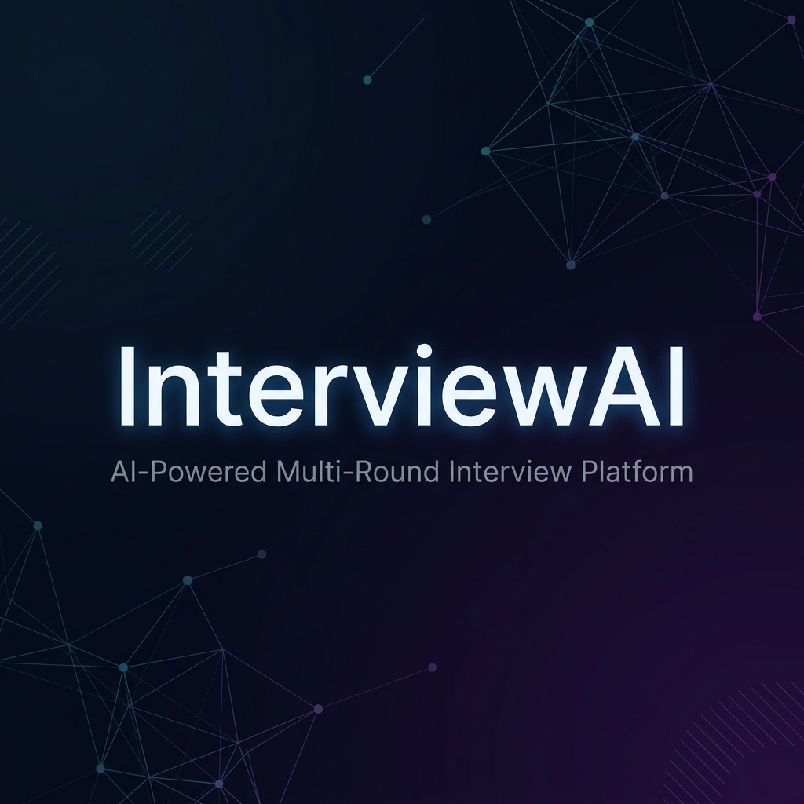
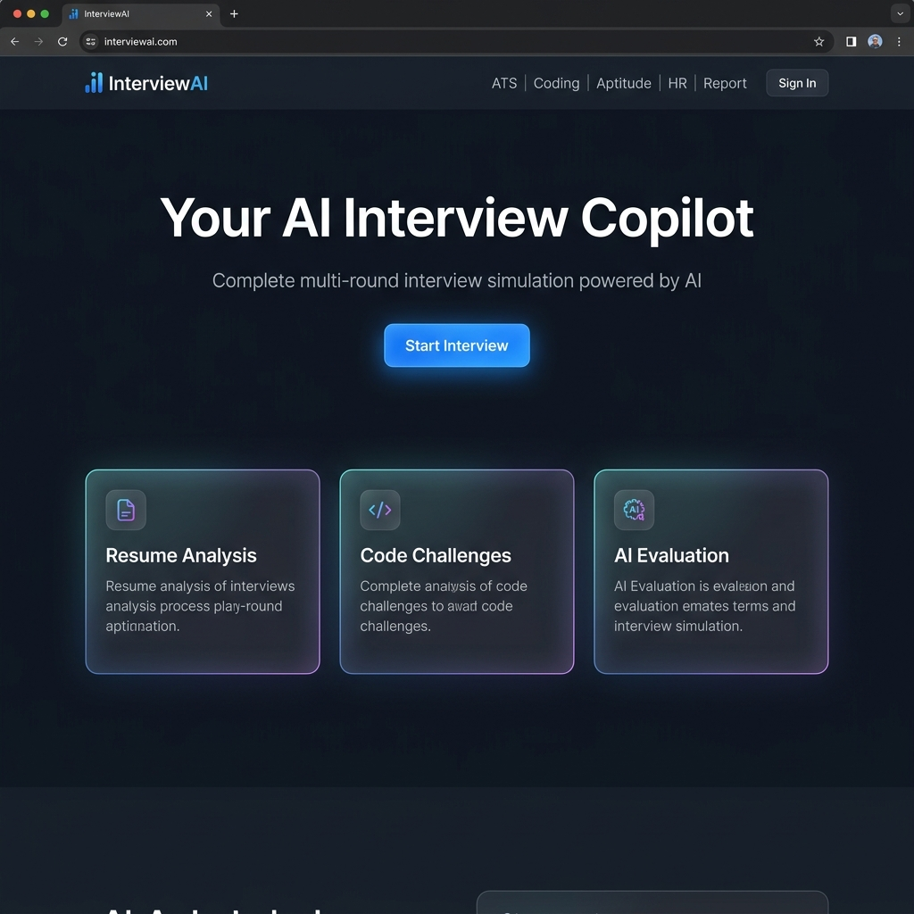
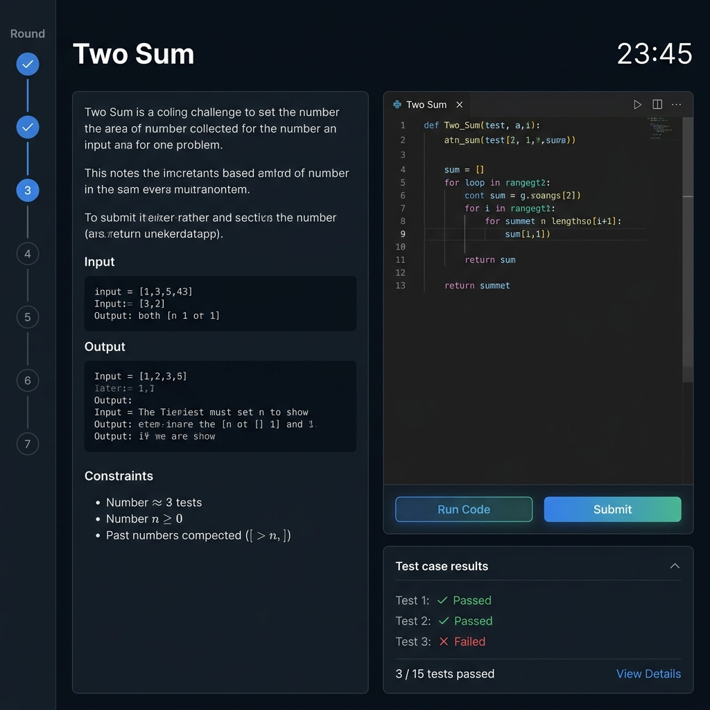
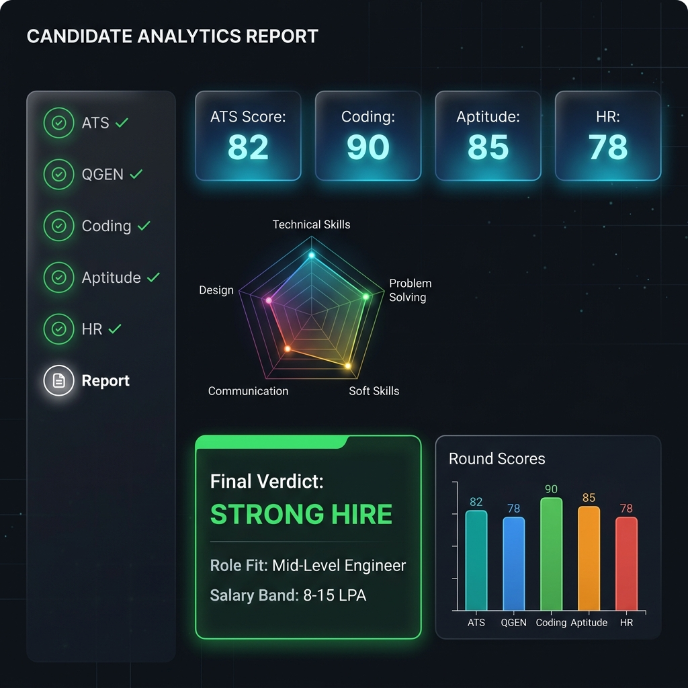
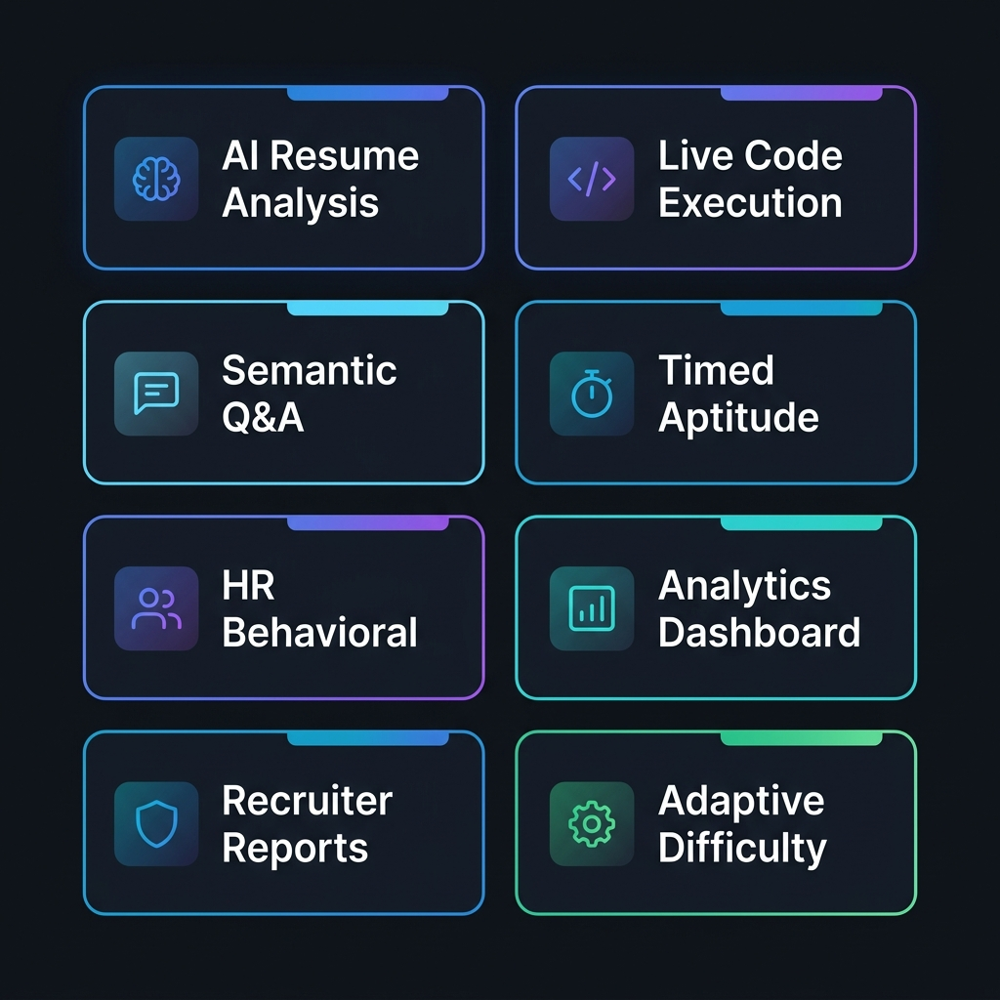
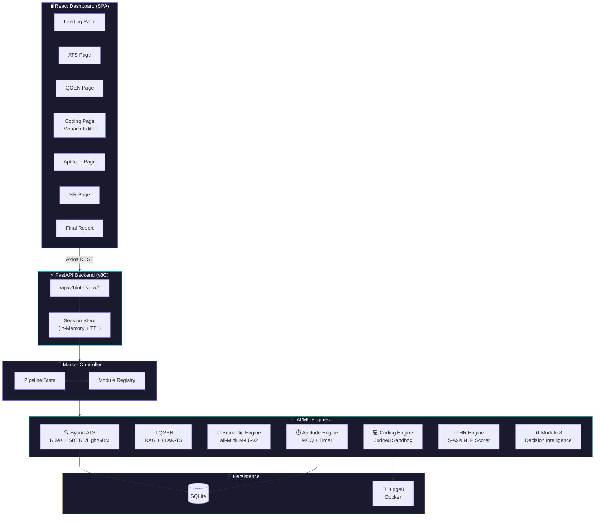
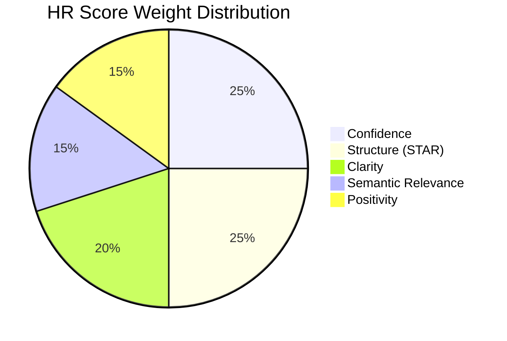
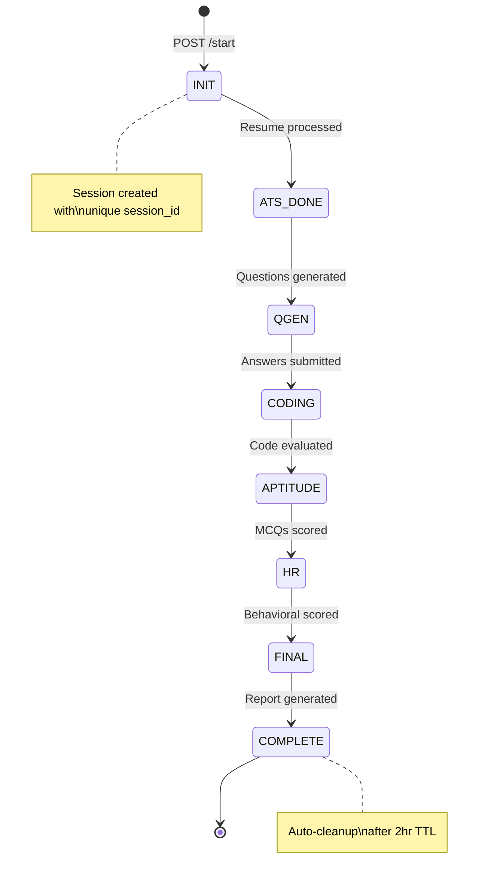
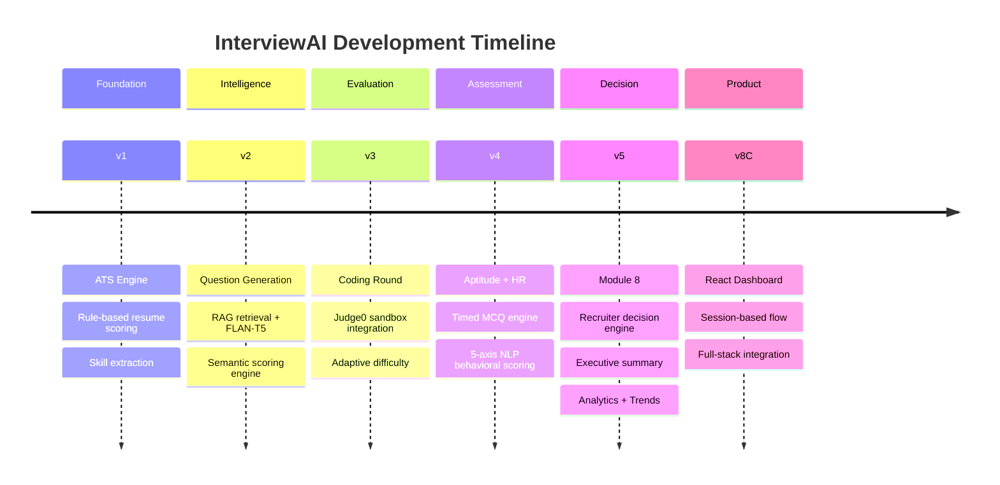

<p align="center">
  
</p>

<h1 align="center">InterviewAI</h1>

<h3 align="center">AI-Powered Multi-Round Interview Simulation Platform</h3>

<p align="center">
  <em>From resume upload to hire/no-hire — a complete AI interview pipeline<br/>that thinks, evaluates, and decides like a real recruiter.</em>
</p>

<br/>

<p align="center">
  
  
  
  
  
  
</p>

<p align="center">
  <a href="#-screenshots">Screenshots</a> •
  <a href="#-why-interviewai">Why?</a> •
  <a href="#-key-features">Features</a> •
  <a href="#-architecture">Architecture</a> •
  <a href="#-pipeline">Pipeline</a> •
  <a href="#-tech-stack">Tech Stack</a> •
  <a href="#%EF%B8%8F-getting-started">Setup</a> •
  <a href="#-api-reference">API</a> •
  <a href="#-project-structure">Structure</a>
</p>

---

<br/>

<h2 align="center">📊 By the Numbers</h2>

<br/>

<table align="center">
<tr>
<td align="center"><h3>6</h3><sub>Interview<br/>Rounds</sub></td>
<td align="center"><h3>11</h3><sub>Pipeline<br/>Phases</sub></td>
<td align="center"><h3>8</h3><sub>AI/ML<br/>Modules</sub></td>
<td align="center"><h3>10+</h3><sub>REST API<br/>Endpoints</sub></td>
<td align="center"><h3>35+</h3><sub>Automated<br/>Tests</sub></td>
<td align="center"><h3>2</h3><sub>Transformer<br/>Models</sub></td>
<td align="center"><h3>5</h3><sub>NLP Scoring<br/>Dimensions</sub></td>
<td align="center"><h3>1</h3><sub>Sandboxed<br/>Code Engine</sub></td>
</tr>
</table>

<br/>

---

## 📸 Screenshots

<p align="center">
  
  <br/>
  <sub><strong>Landing Page</strong> — Start your AI-powered interview simulation</sub>
</p>

<br/>

<p align="center">
  
  <br/>
  <sub><strong>Coding Round</strong> — Monaco editor with live Judge0 sandboxed execution</sub>
</p>

<br/>

<p align="center">
  
  <br/>
  <sub><strong>Final Report</strong> — Recruiter-grade verdict with analytics & hire recommendation</sub>
</p>

<br/>

> 💡 **Tip:** Replace the above mockups with real screenshots of your running application for maximum impact.  
> Launch the app → complete an interview → screenshot each page → save to `docs/images/`.

---

## 🤔 Why InterviewAI?

Most "mock interview" platforms on the market do one thing: **ask questions**.

They don't parse your resume. They don't run your code. They don't score your behavioral answers. And they definitely don't generate a recruiter-grade hiring recommendation.

**InterviewAI does all of it.**

<table>
<tr>
<th width="50%">❌ Typical Mock Interview Apps</th>
<th width="50%">✅ InterviewAI</th>
</tr>
<tr>
<td>

- Ask generic questions from a fixed list
- No resume analysis
- No code execution — just text input
- No behavioral scoring
- No recruiter report
- No adaptive difficulty
- Stateless — no session continuity

</td>
<td>

- **RAG-powered questions** tailored to your resume gaps
- **Hybrid ATS** (rule-based + ML) with skill extraction
- **Judge0 sandboxed execution** with real test cases
- **5-dimension NLP** behavioral scoring
- **Executive summary** with hire/no-hire verdict
- **Adaptive difficulty** that adjusts to your performance
- **Session-based orchestration** — pause, resume, persist

</td>
</tr>
</table>

<br/>

> **InterviewAI doesn't just interview you. It evaluates you — the way a hiring pipeline would.**

---

## ✨ Key Features

<p align="center">
  
</p>

<br/>

<table>
<tr>
<td width="50%">

### 🔍 AI Resume Analysis (ATS)
Hybrid scoring engine combining **rule-based keyword extraction** (30%) with **SBERT + LightGBM ML classification** (70%). Extracts skills, identifies gaps, and produces a quantified resume-to-JD match score.

### 🧠 RAG Question Generation
Technical questions generated from your **resume's weak spots** using cosine-similarity retrieval on a pre-embedded question corpus, refined through **FLAN-T5** language models.

### 💻 Sandboxed Code Execution
Real code runs in **Judge0 Docker containers** — isolated, safe, with retry logic. Supports Python and C++. Test case validation with AI-powered code review.

### ⏱️ Timed Aptitude Assessment
MCQ engine pulling from curated datasets (MNC Aptitude + Logical Reasoning). Enforced time limits. Automatic scoring with persistence.

</td>
<td width="50%">

### 🎯 HR Behavioral Scoring
Answers scored across **5 NLP dimensions**: Semantic Relevance, Positivity (sentiment), Confidence, Clarity, and Structure (STAR framework). Each weighted independently.

### 📊 Recruiter Decision Engine
Module 8 produces a **weighted composite score** → candidate level classification → hiring confidence → role fit → salary band → final verdict. Executive summary included.

### 🔄 Adaptive Difficulty
Coding round difficulty **adjusts in real-time** based on your performance. Score high → harder next problem. Score low → easier. No two sessions are the same.

### 🧩 Session Orchestration
Stateful, session-based interview flow. Round progression tracked server-side (`INIT → ATS → QGEN → CODING → APTITUDE → HR → FINAL → COMPLETE`). TTL-based cleanup. Full pause/resume.

</td>
</tr>
</table>

---

## 🏗 Architecture



### Key Design Decisions

| Decision | Why |
|---|---|
| **Session-based state** | Each interview is a stateful session with enforced round progression. Prevents data leakage between candidates. Enables pause/resume. |
| **Hybrid ATS (30/70 split)** | Rules catch keyword gaps; SBERT + LightGBM captures semantic similarity. Weighted blend is more robust than either alone. |
| **RAG over pure LLM** | Retrieved questions from a curated embedded corpus are more reliable than unconstrained generation. FLAN-T5 kept for research. |
| **Shared SemanticEngine** | `all-MiniLM-L6-v2` loaded once per controller, shared across QGEN + HR scoring. Avoids duplicate 90MB model loads. |
| **Judge0 sandboxing** | Candidate code never runs on the host. Isolated Docker execution with retry logic and exponential backoff. |
| **Weighted final score** | `ATS×0.20 + Coding×0.40 + Aptitude×0.20 + Semantic×0.10 + HR×0.10` — coding weighted highest, matching real industry hiring norms. |

---

## 🔄 Pipeline

The system executes **11 discrete phases**, orchestrated by the `MasterController`:

```mermaid
graph LR
    A["📄 Resume<br/>Upload"] --> B["🔍 ATS<br/>Analysis"]
    B --> C["📝 Question<br/>Generation"]
    C --> D["🧠 Semantic<br/>Scoring"]
    D --> E["📋 Assessment<br/>Planning"]
    E --> F["💻 Coding<br/>Round"]
    F --> G["🔄 Adaptive<br/>Difficulty"]
    G --> H["⏱️ Aptitude<br/>Round"]
    H --> I["🎯 HR<br/>Round"]
    I --> J["📊 Module 8<br/>Decision"]
    J --> K["✅ Final<br/>Verdict"]

    style A fill:#6366f1,stroke:#6366f1,color:#fff
    style B fill:#8b5cf6,stroke:#8b5cf6,color:#fff
    style C fill:#a78bfa,stroke:#a78bfa,color:#fff
    style D fill:#06b6d4,stroke:#06b6d4,color:#fff
    style E fill:#14b8a6,stroke:#14b8a6,color:#fff
    style F fill:#10b981,stroke:#10b981,color:#fff
    style G fill:#22c55e,stroke:#22c55e,color:#fff
    style H fill:#eab308,stroke:#eab308,color:#000
    style I fill:#f97316,stroke:#f97316,color:#fff
    style J fill:#ef4444,stroke:#ef4444,color:#fff
    style K fill:#ec4899,stroke:#ec4899,color:#fff
```



<details>
<summary><strong>📋 Detailed Phase Breakdown (click to expand)</strong></summary>

<br/>

| Phase | Name | What Happens |
|:---:|---|---|
| **1** | ATS Analysis | Resume parsed → skill extraction → hybrid score (rule-based + SBERT/LightGBM) |
| **2** | Question Generation | Missing/weak skills → RAG retrieval (cosine similarity on pre-embedded corpus) → FLAN-T5 refinement |
| **2B** | Semantic Scoring | Candidate QGEN answers scored against questions via sentence-transformer cosine similarity |
| **3** | Assessment Planning | ATS result + JD → difficulty/topic recommendation for coding round |
| **4** | Problem Selection | Topic + difficulty → coding problem from bank (excludes previously attempted) |
| **5** | Coding Round | Code submitted → Judge0 sandbox execution → test case validation → AI code review |
| **6** | Adaptive Difficulty | Score-based difficulty adjustment for next coding problem |
| **7** | Next Problem | Auto-select next problem at adjusted difficulty level |
| **8** | Coding Report | Aggregate scores across all coding attempts |
| **9** | Aptitude Round | Timed MCQ from curated CSV banks (MNC Aptitude + Logical Reasoning) |
| **10** | HR Round | Behavioral questions scored on 5 axes: Semantic · Positivity · Confidence · Clarity · Structure |
| **11** | HR Report | Strengths/weaknesses aggregation |
| **Final** | Module 8 Decision | Weighted composite → EXCELLENT / GOOD / AVERAGE / WEAK → verdict + salary band |

</details>

---

## 🛠 Tech Stack

<table>
<tr>
<td width="50%">

### Backend

| Technology | Role |
|---|---|
|  | Core runtime |
|  | Async REST API + OpenAPI docs |
|  | Semantic similarity (QGEN, HR, RAG) |
|  | Question generation + refinement |
|  | Cosine similarity, ML pipeline |
|  | ML-based ATS classification |
|  | Persistent storage |
| -2496ED?logo=docker&logoColor=white&style=flat-square) | Sandboxed code execution |

</td>
<td width="50%">

### Frontend

| Technology | Role |
|---|---|
|  | Component SPA |
|  | Client-side routing |
|  | Utility-first styling |
|  | Score visualizations |
|  | In-browser code editor |
|  | HTTP client |

</td>
</tr>
</table>

---

## 🧪 ML Models

| Model | Usage | Source |
|---|---|---|
| `all-MiniLM-L6-v2` | Semantic similarity — QGEN scoring, HR scoring, RAG retrieval | [sentence-transformers](https://huggingface.co/sentence-transformers/all-MiniLM-L6-v2) |
| `google/flan-t5-base` | Question generation + refinement | [HuggingFace](https://huggingface.co/google/flan-t5-base) |
| SBERT + LightGBM | ML-based ATS resume-to-JD scoring | Custom trained |
| Sentiment / Confidence / Clarity | HR round multi-axis behavioral analysis | Custom NLP modules |

### Scoring Formula

```
Final Score = ATS × 0.20 + Coding × 0.40 + Aptitude × 0.20 + Semantic × 0.10 + HR × 0.10
```

### HR Behavioral Scoring (5 Dimensions)



### Candidate Classification

| Level | Score | Verdict | Role Fit | Salary Band |
|:---:|:---:|---|---|---|
| 🟢 **EXCELLENT** | ≥ 85 | Hire | Senior / Advanced | 15–25 LPA |
| 🔵 **GOOD** | ≥ 70 | Strong Consideration | Mid-Level | 8–15 LPA |
| 🟡 **AVERAGE** | ≥ 50 | Consider | Junior | 4–8 LPA |
| 🔴 **WEAK** | < 50 | Needs Improvement | Entry Level | 3–5 LPA |

---

## ⚡️ Getting Started

### Prerequisites

| Requirement | Version |
|---|---|
| Python | 3.10+ |
| Node.js | 18+ |
| Docker | Latest (for Judge0) |
| Disk Space | ~2 GB (transformer weights) |

### 1. Clone

```bash
git clone https://github.com/YOUR_USERNAME/ai-mock-interviewer-copilot.git
cd ai-mock-interviewer-copilot
```

### 2. Environment

```bash
cp .env.example .env
# Edit .env with your values (database, Judge0, HuggingFace token)
```

### 3. Backend

```bash
python -m venv .venv
.venv\Scripts\activate                    # Windows
# source .venv/bin/activate               # macOS/Linux

pip install fastapi uvicorn sentence-transformers transformers torch scikit-learn pandas numpy joblib requests python-multipart

uvicorn api.main:app --host 127.0.0.1 --port 8000 --reload
```

### 4. Judge0 (Code Sandbox)

```bash
docker run -d --name judge0 -p 2358:2358 judge0/judge0
```

### 5. Frontend

```bash
cd ai-dashboard
npm install
npm start
# Opens at http://localhost:3000
```

### 6. Verify

| Service | URL |
|---|---|
| Frontend | [http://localhost:3000](http://localhost:3000) |
| Backend API | [http://localhost:8000](http://localhost:8000) |
| Swagger Docs | [http://localhost:8000/docs](http://localhost:8000/docs) |
| ReDoc | [http://localhost:8000/redoc](http://localhost:8000/redoc) |

---

## 📡 API Reference

All session endpoints under `/api/v1/interview`:

### Interview Flow

| Method | Endpoint | Description |
|:---:|---|---|
| `POST` | `/start` | Upload resume + JD → create session, run ATS |
| `POST` | `/qgen/submit` | Submit answers to generated technical questions |
| `GET` | `/coding/problem/{session_id}` | Retrieve assigned coding problem |
| `POST` | `/coding/submit` | Submit code for Judge0 evaluation |
| `GET` | `/aptitude/questions/{session_id}` | Fetch aptitude MCQs |
| `POST` | `/aptitude/submit` | Submit aptitude answers |
| `GET` | `/hr/questions/{session_id}` | Fetch HR behavioral questions |
| `POST` | `/hr/submit` | Submit HR answers for NLP scoring |
| `GET` | `/final/{session_id}` | Complete final report with verdict |
| `GET` | `/status/{session_id}` | Current interview round status |

### Session Lifecycle



---

## 📁 Project Structure

```
📦 InterviewAI
│
├── 📂 api/                              → FastAPI application layer
│   ├── main.py                          → App factory, CORS, router registration
│   ├── session_store.py                 → In-memory session management (TTL cleanup)
│   ├── 📂 routes/
│   │   ├── interview.py                 → Core session interview endpoints (1108 lines)
│   │   ├── coding.py                    → Standalone coding round endpoints
│   │   ├── candidate.py                 → Candidate management
│   │   ├── evaluate.py                  → Evaluation endpoints
│   │   ├── analytics.py                 → Analytics data
│   │   ├── recruiter.py                 → Recruiter report endpoints
│   │   └── executive.py                 → Executive summary endpoints
│   ├── 📂 schemas/                      → Pydantic models
│   ├── 📂 services/                     → Business logic
│   └── 📂 database/                     → DB initialization
│
├── 📂 orchestrator/                     → Pipeline orchestration core
│   ├── master_controller.py             → 11-phase pipeline orchestrator (800 lines)
│   ├── pipeline_state.py                → Mutable state for all round scores
│   └── module_registry.py               → Dependency injection — wires all engines
│
├── 📂 ats/                              → Applicant Tracking System
│   ├── hybrid_ats.py                    → 30% rule-based + 70% ML scoring
│   ├── ml_based_ats.py                  → SBERT + LightGBM classifier
│   ├── score.py                         → Rule-based keyword scoring
│   ├── skill_match.py                   → Skill extraction
│   ├── resume_analyzer.py               → Standalone resume quality analysis
│   ├── extract_text.py                  → PDF/TXT text extraction
│   └── 📂 models/                       → Serialized ML weights
│
├── 📂 qgen/                             → Question Generation (RAG + LLM)
│   ├── qgen_engine.py                   → Retrieval → LLM → clean output
│   ├── retriever.py                     → Cosine-similarity on embedded corpus
│   ├── prompt_builder.py                → LLM prompt construction
│   ├── model_loader.py                  → FLAN-T5 initialization
│   └── 📂 data/                         → Question CSV + embeddings (.npy)
│
├── 📂 coding_round/                     → Sandboxed Code Evaluation
│   ├── coding_engine.py                 → Test execution → verdict → AI review
│   ├── judge0_client.py                 → Judge0 REST client (retry logic)
│   ├── problem_selector.py              → Topic/difficulty-based selection
│   ├── coding_session_manager.py        → Multi-problem session tracking
│   ├── attempt_repository.py            → SQLite persistence
│   ├── ai_review.py                     → Post-submission code review
│   ├── final_report.py                  → Coding round report
│   └── testcase_loader.py               → Test case I/O loader
│
├── 📂 aptitude_round/                   → Timed MCQ Assessment
│   ├── aptitude_engine.py               → MCQ engine + timer + scoring
│   ├── aptitude_repository.py           → SQLite persistence
│   ├── final_report.py                  → Aptitude report generator
│   └── 📂 datasets/                     → CSV question banks
│
├── 📂 hr_round/                         → HR Behavioral Assessment
│   ├── hr_engine.py                     → Question selection + evaluation
│   ├── hr_scorer.py                     → 5-axis NLP scorer
│   ├── hr_questions.py                  → Question bank
│   ├── hr_dataset.py                    → Ideal answer references
│   ├── sentiment_model.py               → Positivity analysis
│   ├── confidence_model.py              → Confidence detection
│   ├── clarity_model.py                 → Clarity scoring
│   ├── structure_model.py               → STAR framework detection
│   └── feedback_generator.py            → Actionable feedback
│
├── 📂 module8/                          → Decision Intelligence Engine
│   ├── 📂 core/                         → Assessment planner + intelligence engine
│   ├── 📂 orchestrator/                 → Interview state machine + difficulty controller
│   ├── 📂 transformer/                  → all-MiniLM-L6-v2 semantic engine
│   ├── 📂 rag/                          → RAG retrieval + knowledge base
│   ├── 📂 recruiter/                    → Hiring confidence + role fit + salary band
│   ├── 📂 executive/                    → Executive summary generator
│   ├── 📂 feedback/                     → Advanced coaching feedback
│   ├── 📂 memory/                       → Interview history + trend engine
│   ├── 📂 analytics/                    → Cross-session analytics
│   └── 📂 schemas/                      → Data schemas
│
├── 📂 ai-dashboard/                     → React Frontend
│   └── 📂 src/
│       ├── App.js                       → Route map (8 pages)
│       ├── 📂 pages/                    → Landing, ATS, QGEN, Coding, Aptitude, HR, Report, Dashboard
│       ├── 📂 components/              → Layout, Navbar, Sidebar, code editor components
│       ├── 📂 services/                → API client (axios)
│       ├── 📂 session/                 → Frontend session management
│       └── 📂 charts/                  → Recharts visualizations
│
├── 📂 tests/                            → 18 backend test files
├── .env.example                         → Environment config template
├── .gitignore                           → Comprehensive ignore rules
└── README.md                            → You are here
```

---

## 🧪 Testing

```bash
# All backend tests
python -m pytest tests/ -v

# Module 8 decision intelligence tests
python -m pytest module8/ -v --tb=short

# Specific modules
python -m pytest tests/test_coding_engine.py -v
python -m pytest tests/test_qgen_engine.py -v
python -m pytest module8/test_recruiter_ai.py -v
```

**Coverage across 35+ test files:**

| Area | What's Tested |
|---|---|
| ATS | Hybrid scoring, skill extraction, resume analysis |
| QGEN | RAG retrieval, prompt building, engine output |
| Coding | Judge0 integration, session management, adaptive difficulty |
| Aptitude | MCQ logic, timer, score calculation |
| HR | Multi-axis NLP scoring, feedback generation |
| Module 8 | Decision engine, orchestrator transitions, trends, RAG, recruiter AI |
| Integration | Full pipeline execution, API endpoint flow |

---

## 📈 Project Evolution



---

## 🚀 Roadmap

- [ ] 🔌 WebSocket real-time interview progression
- [ ] 🌍 Multi-language coding (Java, JavaScript, Go)
- [ ] 💬 LLM-powered conversational HR round
- [ ] 👥 Admin dashboard with candidate comparison
- [ ] 🐳 Docker Compose one-command deployment
- [ ] 🤖 OpenAI / Gemini integration for advanced Q generation
- [ ] 📄 OCR-based resume PDF parsing
- [ ] 🔐 Authentication + multi-tenant support
- [ ] 📱 Mobile-responsive interview flow

---

## 👥 Team

<table>
<tr>
<td align="center" width="200">
<br/>
<strong>Hassibul Kausir</strong>
<br/>
<sub>🎖️ Team Lead</sub>
<br/><br/>
<sub>Architecture · Orchestration · ML Pipeline . ATS ML Model . Coding Round Sandbox <br/>Full-Stack Integration</sub>
<br/><br/>
</td>
<td align="center" width="200">
<br/>
<strong>Sohini Gupta</strong>
<br/>
<sub>👩‍💻 Developer</sub>
<br/><br/>
<sub>Frontend · React Dashboard<br/>UI/UX Design</sub>
<br/><br/>
</td>
<td align="center" width="200">
<br/>
<strong>Krishna Nath</strong>
<br/>
<sub>👨‍💻 Developer</sub>
<br/><br/>
<sub>Backend · API Development<br/>Database Integration</sub>
<br/><br/>
</td>
<td align="center" width="200">
<br/>
<strong>Nandita Saha</strong>
<br/>
<sub>👩‍💻 Developer</sub>
<br/><br/>
<sub>Rule Based Models · NLP Scoring<br/>Semantic Engine</sub>
<br/><br/>
</td>
<td align="center" width="200">
<br/>
<strong>Priya Sarkar</strong>
<br/>
<sub>👩‍💻 Developer</sub>
<br/><br/>
<sub>Testing · QGen Model .  QA · Documentation<br/>Data Curation</sub>
<br/><br/>
</td>
</tr>
</table>

---

## 🤝 Contributing

```bash
# 1. Fork the repo
# 2. Create your branch
git checkout -b feature/amazing-feature

# 3. Commit
git commit -m 'Add amazing feature'

# 4. Push
git push origin feature/amazing-feature

# 5. Open a Pull Request
```

All tests must pass before merging. Run `python -m pytest tests/ module8/ -v` to verify.

---

## 📄 License

Distributed under the **MIT License**. See `LICENSE` for details.

---

<p align="center">
  <br/>
  <strong>InterviewAI</strong>
  <br/>
  <em>An intelligent interview simulation platform that thinks like a recruiter.</em>
  <br/><br/>
  Built with 🧠 transformers, ⚡ FastAPI, ⚛️ React, and 🐳 Judge0
  <br/><br/>
  Made by <strong>Team Hassibul Kausir</strong> · Sohini · Krishna · Nandita · Priya
  <br/><br/>
  <sub>If this project helped you, consider giving it a ⭐</sub>
</p>
